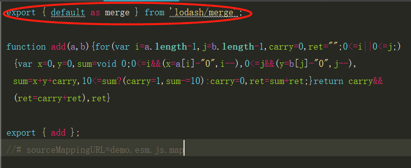
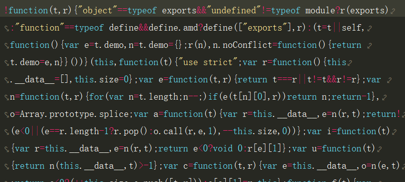

# 编写长整型加法库

什么是长整型呢？

JavaScript中没有整型和浮点之分，这些统称数字，js中的数字占8个字节，64位。当超过这个范围时，js就无法正确的显示数字了。通常情况下，大数字都会使用字符串来存储，这样就不会造成数值不正确。

这一节我们来实现一个大数字加法函数(big_addition)和对象合并的merge方法。大数字加法库的基本要求：两个数字字符串相加，返回相加后的数字字符串。

1. 大数字加法函数(big_addition)的代码实现：

```javascript
export function add(a, b) {
  let i = a.length - 1;
  let j = b.length - 1;

  let carry = 0;
  let ret = '';
  while (i >= 0 || j >= 0) {
    let x = 0;
    let y = 0;
    let sum;

    if (i >= 0) {
      x = a[i] - '0';
      i--;
    }

    if (j >= 0) {
      y = b[j] - '0';
      j--;
    }

    sum = x + y + carry;

    if (sum >= 10) {
      carry = 1;
      sum -= 10;
    } else {
      carry = 0;
    }
    // 0 + ''
    ret = sum + ret;
  }

  if (carry) {
    ret = carry + ret;
  }

  return ret;
};
```

2. 为了演示`external`的功能，我们直接使用`lodash/merge`

```javascript
import merge from 'lodash/merge';

export { merge };
```

修改`rollup.config.js`:

```git
- external: [],
+ external: ['lodash/merge'],
```

编译源码：

```shell
npm run build
```

下面我们来看看打包编译之后的代码;

- esm格式



- 浏览器umd格式



## 示例代码地址

[点击查看](https://github.com/bugszhou/doc-rollupjs/tree/master/src/examples/demo)

