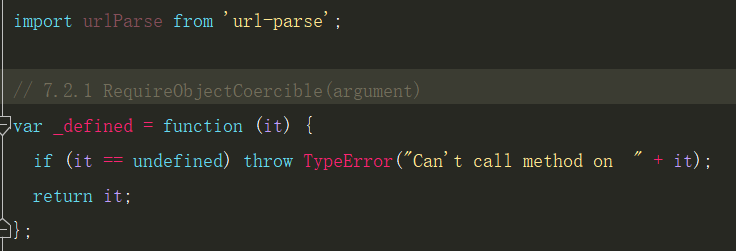
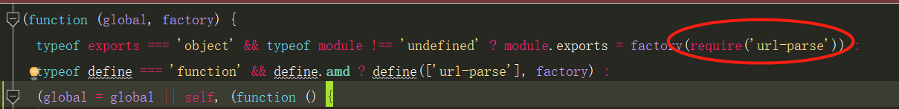

# 编写类库的需求

1. 支持浏览器直接使用的压缩后的js文件和可供调试未压缩混淆的js文件
2. 支持在es6环境下直接使用esm(es6)的模块，未压缩的js文件
3. 使用umd不打包依赖的包，压缩和未压缩的js文件

需要生效5个js文件

我们先解释一下，这5个文件的用途：

- 1. 支持浏览器直接使用的压缩后的js文件和可供调试未压缩混淆的js文件

这个两个js文件，包含了所有的依赖包。如果其他业务逻辑有相同的依赖，会存在重复的相同代码。这种方式的好处就是可以直接使用，不需要直接引用，通常使用`script`标签来引用。压缩和未压缩文件只是为了方便使用者调试代码。

- 2. 支持在es6环境下直接使用esm(es6)的模块，未压缩的js文件

目前很多项目都是使用webpack等工程化构建工具来研发的，使用esm模块的功能，可以避免相同依赖包多次打包。因为esm包是使用`import、export`等es6的模块化语法，能够支持tree-shaking，减少无用代码。

打包后的效果如图：

- 3. 使用umd不打包依赖的包，压缩和未压缩的js文件

这种打包方式，主要是使用umd的模块规范，开发者在使用该模块时，需要自行处理相关依赖包。

打包后的效果如图：

下面我们定义一下编译后的文件名：

    包名.dev.js -- 用于浏览器直接引用的开发版，未压缩
    包名.min.js -- 用于浏览器直接引用的生产版，压缩混淆
    包名.esm.js -- 用于webpack等构建工具，使用`import、export`等es6模块化语法
    包名.common.js -- 使用`umd`模块规范的压缩混淆版
    包名.js -- 使用`umd`模块规范的未压缩混淆版

    例如：lodash.dev.js/lodash.min.js/lodash.esm.js/lodash.common.js/lodash.js

- **什么是umd模块规范方案[点击查看](https://segmentfault.com/a/1190000012419990)**

